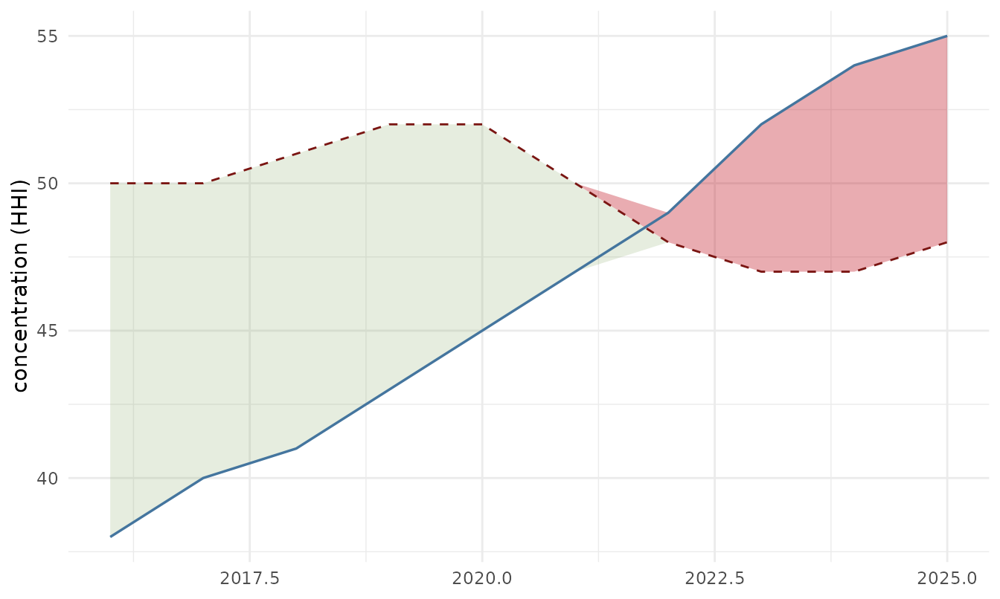
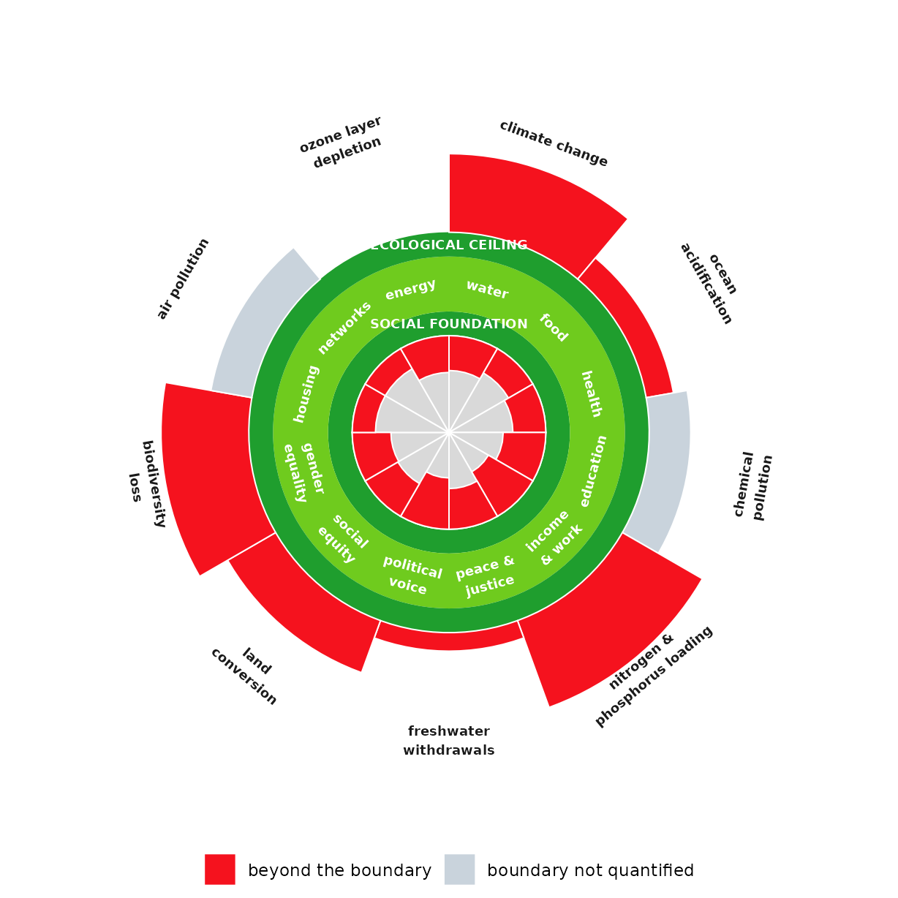

# Trajectories against moving boundaries

``` r

library(ggplot2)
library(ggboundary)
```

## The idea

A boundary is not always a constant. Doughnut Economics and the
planetary-boundaries wheel draw the safe threshold as a fixed line, but
a system’s safe threshold often moves with its own capacity: a tourism
economy’s carrying capacity rises as it builds room stock and can be
lowered again by policy, a reserve buffer’s adequacy shifts with the
risk it faces. `ggboundary` draws the boundary as a series so that
movement is visible, and shades where the trajectory overshoots it.

## `geom_boundary()`

``` r

df <- data.frame(
  year = 2016:2025,
  hhi  = c(38, 40, 41, 43, 45, 47, 49, 52, 54, 55),
  cap  = c(50, 50, 51, 52, 52, 50, 48, 47, 47, 48)
)

ggplot(df) +
  geom_boundary(df, "year", "hhi", "cap") +
  labs(y = "concentration (HHI)", x = NULL) +
  theme_minimal()
```



The dashed line is the boundary, moving. Red marks overshoot, green
marks slack.

## The Doughnut, as the single-instant snapshot

[`doughnut()`](https://rendell.github.io/ggboundary/reference/doughnut.md)
draws the other half of the grammar: many dimensions, one moment. The
two rings carry independent dimension sets, so a twelve-part social
foundation and a nine-part ecological ceiling divide the circle
differently, as in Raworth’s original. Shortfalls bite inward toward the
hole, overshoots break outward past the ceiling, and both are red.

``` r

social <- data.frame(
  dimension = c("water", "food", "health", "education", "income & work",
                "peace & justice", "political voice", "social equity",
                "gender equality", "housing", "networks", "energy"),
  shortfall = c(0.36, 0.29, 0.34, 0.44, 0.53, 0.42,
                0.53, 0.39, 0.40, 0.24, 0.24, 0.38))

ecological <- data.frame(
  dimension = c("climate change", "ocean acidification", "chemical pollution",
                "nitrogen & phosphorus loading", "freshwater withdrawals",
                "land conversion", "biodiversity loss", "air pollution",
                "ozone layer depletion"),
  overshoot = c(0.85, 0.30, NA, 1.00, 0.20, 0.60, 0.95, NA, 0))

doughnut(social, ecological)
```



Read the two together. The Doughnut says where you stand across many
dimensions at one instant;
[`geom_boundary()`](https://rendell.github.io/ggboundary/reference/geom_boundary.md)
says how one of them got there, and whether the boundary itself was
moving while it did.
