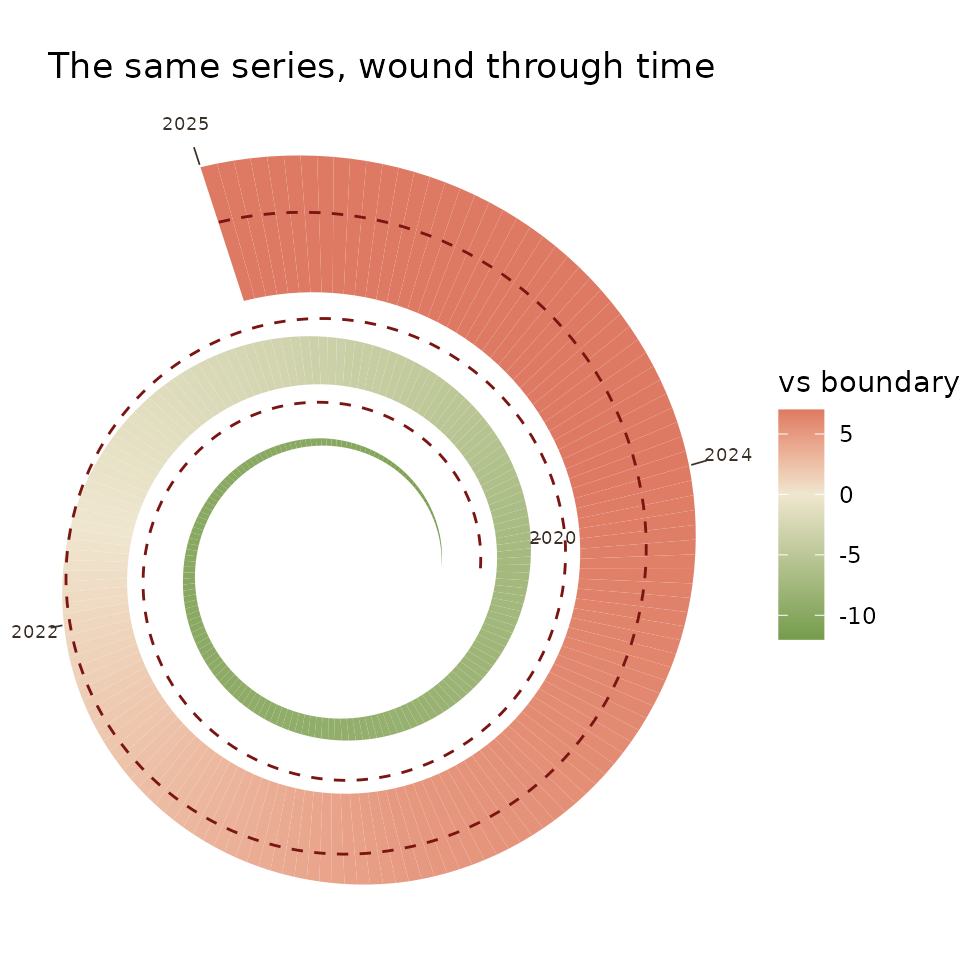

# Trajectories against moving boundaries

``` r

library(ggplot2)
library(ggboundary)
```

## The idea

A boundary is not always a constant. Doughnut Economics and the
planetary-boundaries wheel draw the safe threshold as a fixed line, but
a system’s safe threshold often moves with its own capacity: a tourism
economy’s carrying capacity rises as it builds room stock and can be
lowered again by policy, a reserve buffer’s adequacy shifts with the
risk it faces. `ggboundary` draws the boundary as a series so that
movement is visible, and shades where the trajectory overshoots it.

## `geom_boundary()`

``` r

df <- data.frame(
  year = 2016:2025,
  hhi  = c(38, 40, 41, 43, 45, 47, 49, 52, 54, 55),
  cap  = c(50, 50, 51, 52, 52, 50, 48, 47, 47, 48)
)

ggplot(df) +
  geom_boundary(df, "year", "hhi", "cap") +
  labs(y = "concentration (HHI)", x = NULL) +
  theme_minimal()
```


The dashed line is the boundary, moving. Red marks overshoot, green
marks slack.

## The doughnut, as the single-instant snapshot

``` r

d <- data.frame(dim = c("water", "food", "energy", "income", "health"),
                v = c(0.2, 0.5, 0.8, 0.45, 0.7))
doughnut(d, "dim", "v")
```


## The conch, as the expressive companion

``` r

conch(df$year, df$hhi, df$cap, label_fmt = round,
      title = "The same series, wound through time")
```



Use the conch to make the boundary idea memorable, not to read values
off. When precision matters, the Cartesian
[`geom_boundary()`](https://rendell.github.io/ggboundary/reference/geom_boundary.md)
above is the tool.
